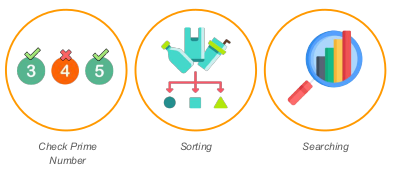
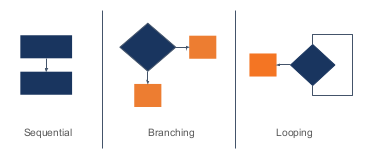
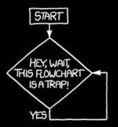
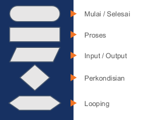
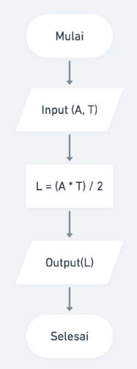
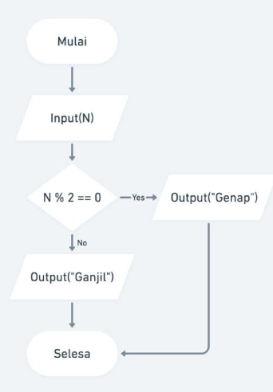
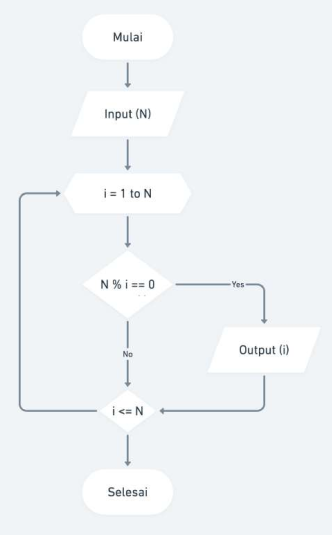

# Tugas Unjuk Ketrampilan

## Rangkuman Materi Algoritma

### 1. Apa itu Algoritma?


Algoritma adalah prosedur komputasi yang didefinisikan dengan baik yang
mengambil beberapa nilai sebagai input dan menghasilkan beberapa nilai
sebagai output.

Contoh Algoritma:



### 2. Karakteristik Algoritma

- Memiliki batas awal dan akhir
- Instruksi terdefinisi
- Efektif dan Efisien

### Algoritma Dasar



### Pseudocode

Contoh kasus:

MENGHITUNG LUAS SEGITIGA

```
1. INPUT Alas and Tinggi
2. CALCULATE Luas = (Alas x Tinggi) / 2
3. PRINT Luas

```

### Flow chart

Flowchart adalah adalah suatu bagan dengan simbol tertentu yang menggambarkan urutan dan hubungan antar proses secara mendetail.



Simbol-simbol Flowchart



Contoh kasus:

1. MENGHITUNG LUAS SEGITIGA
   
2. MENENTUKAN BILANGAN GANJIL
   
3. MENCETAK FAKTOR BILANGAN
   
