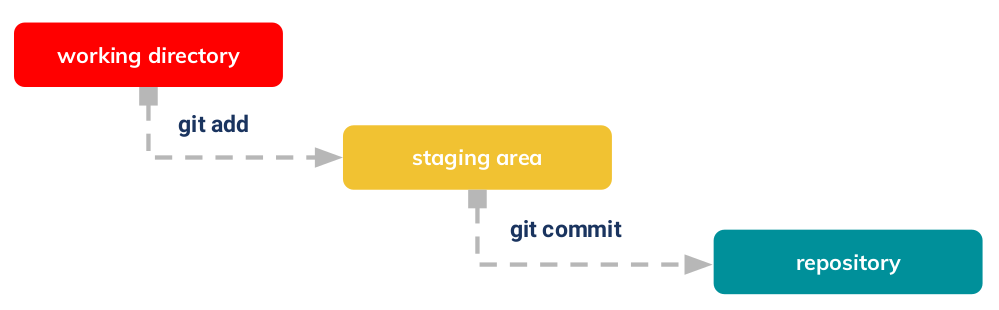
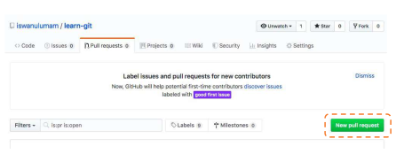
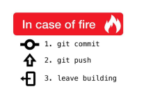

# Tugas Unjuk Ketrampilan

## Rangkuman Materi Algoritma

### 1. Apa itu Algoritma?


Algoritma adalah prosedur komputasi yang didefinisikan dengan baik yang
mengambil beberapa nilai sebagai input dan menghasilkan beberapa nilai
sebagai output.

Contoh Algoritma:


### 2. Karakteristik Algoritma

- Memiliki batas awal dan akhir
- Instruksi terdefinisi
- Efektif dan Efisien

### Algoritma Dasar


### Pseudocode

Contoh kasus:

MENGHITUNG LUAS SEGITIGA

```
1. INPUT Alas and Tinggi
2. CALCULATE Luas = (Alas x Tinggi) / 2
3. PRINT Luas

```

### Flow chart

Flowchart adalah adalah suatu bagan dengan simbol tertentu yang menggambarkan urutan dan hubungan antar proses secara mendetail.


Simbol-simbol Flowchart


Contoh kasus:


1. MENGHITUNG LUAS SEGITIGA
   
   

2. MENENTUKAN BILANGAN GANJIL
   
   

3. MENCETAK FAKTOR BILANGAN
   
   


## Rangkuman Version Control and Branch Managemt (Git)


### Apa itu Versioning?
untuk mengatur versi dari source code program.


### Tools

- Version Control System (VCS)
- Source Code Manager (SCM)
- Revision Control System (RCS)

### Version Control System 

#### Single User
- SCCS - 1972 Unix only
- RCS - 1982 Cross platform, text only

#### Centralized
- CVS - 1986 File focus
- Perforce - 1995
- Subversion - 2000 - track directory structure
- Microsoft Team Foundation Server - 2005

#### Distributed
- Git - 2005
- Mercurial - 2005
- Bazaar - 2005

### Git
Salah satu version control system populer yang digunakan para developer untuk mengembangkan software secara bersama-bersama.

### Git Install
#### MacBook

Download the latest: https://sourceforge.net/projects/git-osx-installer/files/


```bash
$ git --version
git version 2.9.2
```

#### Windows

Download the latest: https://git-for-windows.github.io/

#### Linux

```bash
$ sudo apt-get update
$ sudo apt-get install git

$ git --version
git version 2.9.2

```


### Setting Up

#### GIT INIT, CLONE, CONFIG

```bash
# git config
$ git config --global user.name “John Done”
$ git config --global user.email “johndoe@email.com”

#start with init
$ git init
$ git remote add <remote_name> <remote_repo_url>
$ git push -u <remote_name> <local_branch_name>

# start with existing project, start working on the project
$ git clone ssh://john@example.com/path/to/my-project.git
$ cd my-project
```


### Saving Changes

#### THE STAGING AREA



#### GIT STATUS, ADD, COMMIT

```bash
$ git status
$ git add <directory>
$ git add hello.py
$ git add .
$ git commit -m “add config file”
```

#### GIT DIFF AND STASH

```bash
# git diff
# change file
# add staging area
$ git diff --staged
# stashing your work
$ git stash
# re-applying your stashed changes
$ git stash apply
```

#### FILE .gitignore

| Pattern | Example matches                                                         | Explanation                                                                                                                                                                                          |
| ------- | ----------------------------------------------------------------------- | ---------------------------------------------------------------------------------------------------------------------------------------------------------------------------------------------------- |
| *.log   | Debug.log foo.log .log logs/debug.log                                   | An asterisk is a wildcard that matches zero or more characters.                                                                                                                                      |
| logs    | logs logs/debug.log logs/latest/foo.bar build/logs build/logs/debug.log | If you don't append a slash, the pattern will match both files and the contents of directories with that name. In the example matches on the left, both directories and files named logs are ignored |


### Inspecting Repository

#### GIT LOG, CHECKOUT

```bash
# viewing an old revision
$ git log --oneline
# b7119f2 Continue doing crazy things
# 872fa7e Try something crazy
# a1e8fb5 Make some important changes to hello.txt
$ git checkout a1e8fb5
```

#### GIT RESET


#### GIT RESET

```bash
# viewing an old revision
$ git log --oneline
# b7119f2 Continue doing crazy things
# 872fa7e Try something crazy
# a1e8fb5 Make some important changes to hello.txt
$ git reset a1e8fb5 --soft
```

### Syncing

#### GIT PUSH, FETCH & PULL

```bash
# git remote
$ git remote -v
$ git remote add origin http://dev.example.com/john.git
# fetch and pull
$ git fetch
$ git pull origin master
# push
$ git push origin master
$ git push origin feature/login-user
```


### Branches

#### GIT BRANCHING

```bash
# show all branch
$ git branch --list
# create a new branch called <branch>
$ git branch <branch>
# force delete the specified branch
$ git branch -D <branch>
# list remote branch
$ git branch -a
```


#### GIT MERGE

```bash
# Start a new feature
git checkout -b new-feature master
# Edit some files
git add <file>
git commit -m "Start a feature"
# Edit some files
git add <file>
git commit -m "Finish a feature"
# Merge in the new-feature branch
git checkout master
git merge new-feature
git branch -d new-feature
```

### Pull Request



